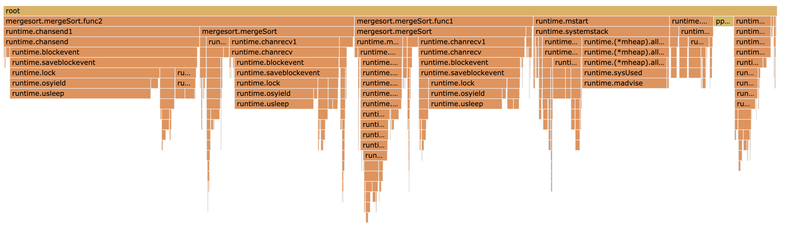
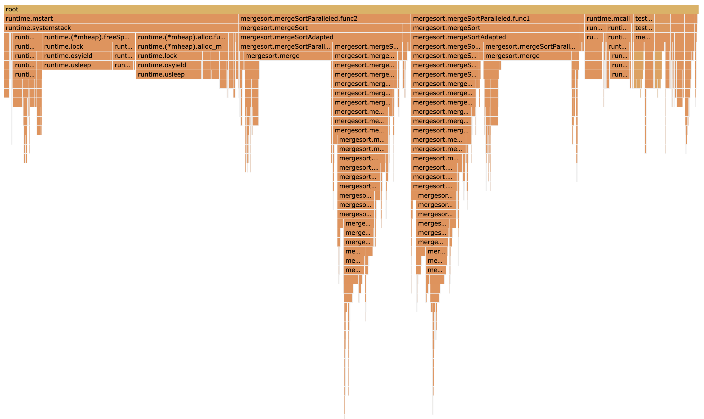

# mergesort学习笔记
## 背景
作业要求实现一个归并排序程序, 在测试框架上的测试结果要求比标准库sort.Slice()速度快, 并给出相关性能分析.

先看一下std的sort.Slice()的实现:

```
func Slice(slice interface{}, less func(i, j int) bool) {
	rv := reflectValueOf(slice) // 通过反射拿到元素的值
	swap := reflectSwapper(slice) // 通过反射拿到Swap函数
	length := rv.Len()
	quickSort_func(lessSwap{less, swap}, 0, length, maxDepth(length)) // 快速排序
}
```

简单来说就是一个针对任意类型的快速排序算法. 注意快速排序是不稳定的.

## 实现1
使用单goroutine的归并排序. 修改Makefile中的bench中的定义, 运行性能测试并生成pprof文件.

测试结果如下:

```
BenchmarkMergeSort-12    	       1	3013113213 ns/op	3221302312 B/op	16777250 allocs/op
BenchmarkMergeSort-12    	       1	2759160071 ns/op	3221316264 B/op	16777248 allocs/op
BenchmarkMergeSort-12    	       1	2766461254 ns/op	3221292744 B/op	16777235 allocs/op
BenchmarkMergeSort-12    	       1	2750119895 ns/op	3221323920 B/op	16777224 allocs/op
BenchmarkMergeSort-12    	       1	2862713174 ns/op	3221282832 B/op	16777223 allocs/op
BenchmarkNormalSort-12    	       1	3226377067 ns/op	   62528 B/op	      22 allocs/op
BenchmarkNormalSort-12    	       1	3216535291 ns/op	   62656 B/op	      16 allocs/op
BenchmarkNormalSort-12    	       1	3335189878 ns/op	   34560 B/op	      18 allocs/op
BenchmarkNormalSort-12    	       1	3253828494 ns/op	   83136 B/op	      16 allocs/op
BenchmarkNormalSort-12    	       1	3213671140 ns/op	   32832 B/op	       6 allocs/op
```

- commit: d920393b2a97297dbc241f808bdf95c540cab724
- pprof: .pprof/20200302_115930

可以看到性能测试结果已经比NormalSort要略快一点点了, 但是内存分配次数会更多一些, 因为代码实现中的每次merge操作都会分配内存.

CPU火焰图:

[cpu_single](assets/mergesort_flamegraph_cpu_single.png)

## 实现2
使用不限制数量的goroutine递归调用mergeSort, 通过阻塞式chan返回结果, 再进行merge.

```
func mergeSort(data []int64) []int64 {
	if len(data) <= 1 {
		return data
	}
	middle := len(data) / 2

	leftChan := make(chan []int64)
	rightChan := make(chan []int64)
	go func() {
		leftChan <- mergeSort(data[:middle])
	}()
	go func() {
		rightChan <- mergeSort(data[middle:])
	}()

	return merge(<-leftChan, <-rightChan)
}
```

测试结果如下:

```
BenchmarkMergeSort-12    	       1	15146993507 ns/op	7339573056 B/op	53373411 allocs/op
BenchmarkMergeSort-12    	       1	15897256881 ns/op	6729632848 B/op	52219733 allocs/op
BenchmarkMergeSort-12    	       1	15738761015 ns/op	6544407472 B/op	51390218 allocs/op
BenchmarkMergeSort-12    	       1	15689716663 ns/op	6574298512 B/op	51703442 allocs/op
BenchmarkMergeSort-12    	       1	16172783983 ns/op	6560658928 B/op	51561509 allocs/op
BenchmarkNormalSort-12    	       1	3272241595 ns/op	   62240 B/op	      20 allocs/op
BenchmarkNormalSort-12    	       1	3259407784 ns/op	   62368 B/op	      14 allocs/op
BenchmarkNormalSort-12    	       1	3355198882 ns/op	   33696 B/op	      12 allocs/op
BenchmarkNormalSort-12    	       1	3363029882 ns/op	   74800 B/op	      14 allocs/op
BenchmarkNormalSort-12    	       1	3445930557 ns/op	   41024 B/op	       7 allocs/op
```

- commit: 6aea4fe003549df2bf5e1a4ddde100b9ec591ab9
- pprof: .pprof/20200302_121322

可以看出, 每次测试的耗时大约是单goroutine的8倍, 内存分配次数也是将近4倍, 内存分配空间大约2倍.

通过CPU火焰图可以看到, 大量CPU时间花费在了chan的发送和接收的等待上面.



之所以这样, 是因为开启了过多的goroutine进行通道等待, 实际计算用到的goroutine其实并不多.

做一个小小的改进: 当切片长度超过一定值时, 才进行并行排序, 否则进行串行排序.

将该值设置为1024, 执行性能测试, 结果如下:

```
BenchmarkMergeSort-12    	       2	 739375190 ns/op	3228715584 B/op	16854920 allocs/op
BenchmarkMergeSort-12    	       2	 712113004 ns/op	3228889720 B/op	16856626 allocs/op
BenchmarkMergeSort-12    	       2	 781279710 ns/op	3231905800 B/op	16870876 allocs/op
BenchmarkMergeSort-12    	       2	 811769486 ns/op	3230533608 B/op	16868843 allocs/op
BenchmarkMergeSort-12    	       2	 750999376 ns/op	3228774744 B/op	16855685 allocs/op
BenchmarkNormalSort-12    	       1	3172112878 ns/op	   45712 B/op	      17 allocs/op
BenchmarkNormalSort-12    	       1	3085135556 ns/op	   62368 B/op	      14 allocs/op
BenchmarkNormalSort-12    	       1	3244486853 ns/op	   41024 B/op	       7 allocs/op
BenchmarkNormalSort-12    	       1	3213514731 ns/op	   75376 B/op	      18 allocs/op
BenchmarkNormalSort-12    	       1	3159804064 ns/op	   32832 B/op	       6 allocs/op
```

commit: 72a820d1f9712b39140cc772b9a678dc317cc942
pprof: .pprof/20200302_135153

可以看到, 时间已经缩短至NormalSort的1/4左右了. 再看一下CPU火焰图:



现在, 内存分配和GC占据了较大的CPU耗时比重, 能否减少内存分配次数?

## 测试环境
本机, MacBook Pro 2019, 6核i7, 32G内存

## 参考资料
- https://blog.golang.org/profiling-go-programs
